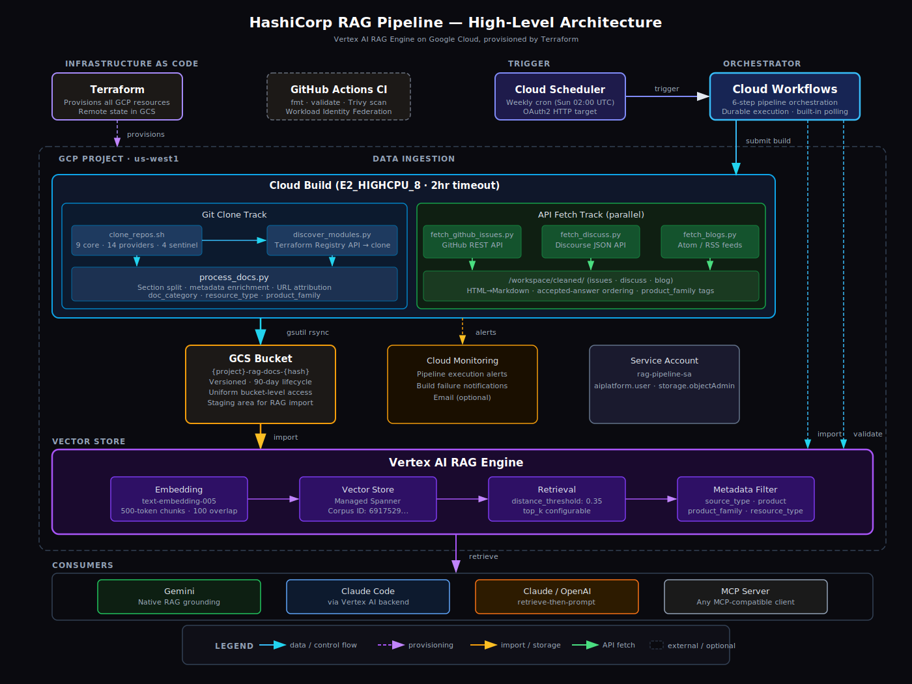
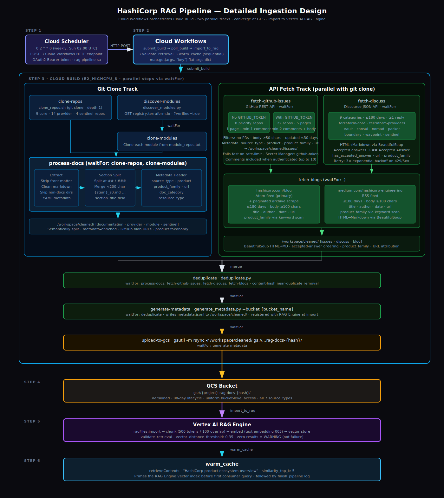

# gcp-hashi-knowledge-base

A production-grade Terraform repository that provisions and operates two
complementary knowledge stores on Google Cloud, both surfaced through a single
MCP server:

1. **HashiCorp Docs Pipeline** — ingests HashiCorp product documentation,
   forum threads, blog posts, and GitHub issues into a **Vertex AI RAG Engine**
   corpus for retrieval-augmented generation. Always on.
2. **Terraform Graph Store** — runs `terraform graph` against your own
   Terraform workspace repos and loads the resource dependency graph into a
   **Spanner Graph** property graph (`tf_graph`). Opt-in via
   `create_graph_store = true`.

Five MCP tools are exposed through `mcp/server.py`:

| Tool | Backend | Purpose |
|---|---|---|
| `search_hashicorp_docs` | Vertex AI RAG | Semantic search over docs/issues/discuss/blog |
| `get_corpus_info` | Vertex AI RAG | Inspect the active corpus |
| `get_resource_dependencies` | Spanner Graph | Walk Terraform dependency graph (upstream/downstream) |
| `find_resources_by_type` | Spanner Graph | List every resource of a given type, optionally per repo |
| `get_graph_info` | Spanner Graph | Counts of nodes/edges/repos and tool inventory |

Clone it, set a few variables, and run `task up` — a single command
provisions all docs-side infrastructure and ingests the documentation. The
graph store is opt-in: set `create_graph_store = true`, list your workspace
repos in `graph_repo_uris`, re-apply, and run `task graph:populate`. The RAG
corpus is created once by `scripts/create_corpus.py` (get-or-create) and its
ID is passed to every workflow execution via Terraform. No GitHub App
installation, no PATs, no manual steps.

---

## Architecture

<p align="center">
  
</p>

Cloud Scheduler triggers Cloud Workflows weekly. Workflows orchestrates Cloud Build (data ingestion), Vertex AI RAG Engine (import), and a multi-query retrieval validation step that tests all 7 product families and 3 source types. All infrastructure is provisioned by Terraform. Cloud Build clones this repository directly via its public HTTPS URL — no GitHub connection, trigger, or personal access token is required.

### Ingestion Pipeline

<p align="center">
  
</p>

The pipeline runs two parallel tracks inside Cloud Build: a **git clone track** that shallow-clones HashiCorp repos and processes markdown through semantic section splitting and metadata enrichment, and an **API fetch track** that queries the GitHub Issues API, Discourse API, and blog feeds in parallel. Both tracks converge at a single `gsutil rsync` upload step, after which Cloud Workflows calls the Vertex AI RAG Engine import API to chunk, embed, and index all documents.

---

## Data Sources

The pipeline ingests content from seven source types across three collection methods, all fetched automatically during each build:

### Git-cloned sources

These are shallow-cloned from GitHub, then processed into cleaned markdown with enriched metadata headers.

| Source | `source_type` | Repos | What's ingested |
|---|---|---|---|
| **HashiCorp core products** | `documentation` | 9 repos — Terraform, Vault, Consul, Nomad, Packer, Boundary, Waypoint, terraform-docs-agents, terraform-website | Official product documentation from `website/docs/` or `website/content/` directories |
| **Terraform providers** | `provider` | 14 repos — AWS, Azure, GCP, Kubernetes, Helm, Docker, Vault, Consul, Nomad, Random, Null, Local, TLS, HTTP | Resource and data source reference docs with argument/attribute tables and HCL examples |
| **Terraform Registry modules** | `module` | Dynamically discovered via the Registry API | Docs from HashiCorp-verified modules |
| **Sentinel policy libraries** | `sentinel` | 4 repos — core policies + AWS/Azure/GCP networking | Policy definitions and usage documentation |

### API-fetched sources

These run in parallel with the Git clone pipeline, fetched via REST APIs and written directly to the cleaned output directory.

| Source | `source_type` | API | What's ingested |
|---|---|---|---|
| **GitHub Issues** | `issue` | GitHub REST API | Issues updated in the last 30 days from 8 priority repos (22 with `GITHUB_TOKEN`). Filtered for quality: PRs excluded, minimum body length (50 chars), minimum comment count (1 unauth / 2 auth). Comments included when authenticated (up to 10 per issue). |
| **HashiCorp Discuss** | `discuss` | Discourse JSON API | Forum threads with at least 1 reply from the last 180 days across 9 categories (terraform-core, terraform-providers, vault, consul, nomad, packer, boundary, waypoint, sentinel). Up to 5 replies per thread. |
| **HashiCorp Blog** | `blog` | Atom/RSS feeds + HTML scraping | Posts from the last 180 days from hashicorp.com/blog (Atom feed + paginated archive) and medium.com/hashicorp-engineering (RSS feed). Full article content extracted via BeautifulSoup. |

### Metadata enrichment

Every document body begins with a compact single-line attribution prefix. This replaces a verbose multi-line YAML header, reducing metadata overhead from ~100 tokens to ~15 tokens per retrieved chunk:

```
[provider:aws] aws_instance — Argument Reference

[discuss:terraform] How do I manage multiple workspaces?

[issue:vault] #1234 (closed): Dynamic secrets not rotating

[blog:terraform] Running Terraform in CI — Setting Up Remote State
```

The full metadata (`product`, `product_family`, `source_type`, `file_name`) is stored separately in `metadata.jsonl` by `generate_metadata.py` and registered with the RAG Engine at import time — available for filtered retrieval via CEL expressions without consuming body tokens.

| Field | Present in | Description |
|---|---|---|
| `source_type` | all | `documentation`, `provider`, `module`, `sentinel`, `issue`, `discuss`, `blog` |
| `product` | all | Specific product name (e.g. `aws`, `vault`, `terraform`) |
| `product_family` | all | Top-level grouping — `terraform` for all providers/sentinel, product name for core products |
| `repo` | all | Source repository or site name |
| `title` | all | Document or issue title |
| `description` | all | Brief description or issue summary |
| `url` | all | Canonical source URL (GitHub blob, issue, Discuss thread, or blog post) |
| `doc_category` | docs | `resource-reference`, `data-source-reference`, `guide`, `cli-reference`, `api-reference`, `getting-started`, `internals`, `upgrade-guide`, `configuration`, `documentation` |
| `resource_type` | providers | Terraform resource/data source name (e.g. `aws_instance`, `google_compute_network`) |
| `section_title` | docs | Heading text for semantically split document sections |
| `has_accepted_answer` | discuss | `true` if the thread has a community-accepted answer |

---

## Prerequisites

- **GCP project** with billing enabled
- **GCP IAM roles** — the deploying user needs 12 project-level roles (see [Deployer IAM roles](docs/RUNBOOK.md#deployer-iam-roles) for the full list and a grant-all script)
- **gcloud CLI** installed and authenticated (see step 2 below)
- **Terraform** >= 1.5, < 2.0
- **Python** 3.11+
- **Task** ([taskfile.dev](https://taskfile.dev)) — `brew install go-task` or `go install github.com/go-task/task/v3/cmd/task@latest`
- **Python packages** — `pip install google-cloud-aiplatform pyyaml requests pytest beautifulsoup4`
- **shellcheck** — `brew install shellcheck` (used by preflight checks)
- **jq** — `brew install jq` (used by preflight checks)

---

## Quick start

1. **Clone the repository**

   ```bash
   git clone <this-repo-url>
   cd hashicorp-vertex-ai-rag
   ```

2. **Authenticate with Google Cloud and set the active project**

   ```bash
   task login PROJECT_ID=my-gcp-project
   ```

   This runs `gcloud auth login` (CLI) and `gcloud auth application-default login` (ADC for Terraform and Python scripts) in sequence, then sets the active project. All subsequent `task` commands auto-detect the project ID from `gcloud config` — you don't need to pass `PROJECT_ID` again.

3. **Install Python dependencies**

   ```bash
   pip install google-cloud-aiplatform pyyaml requests pytest beautifulsoup4
   ```

4. **Run preflight checks** (optional — `task up` runs these automatically)

   ```bash
   task preflight
   ```

   Validates CLI tools (terraform, gcloud, python3, jq, shellcheck), version requirements (Terraform >= 1.5, Python >= 3.11), GCP authentication and project access, Python packages, repository file integrity, and Terraform formatting/validation. Each sub-check can also be run independently: `task preflight:tools`, `task preflight:auth`, `task preflight:python`, `task preflight:files`, `task preflight:terraform`.

5. **Deploy everything with one command**

   Both GCS bucket names are derived automatically from the project ID:
   - State: `<PROJECT_ID>-tf-state-<8-char hash>`
   - RAG docs: `<PROJECT_ID>-rag-docs-<8-char hash>`

   ```bash
   task up REPO_URI=https://github.com/my-org/hashicorp-vertex-ai-rag
   ```

   You can override the auto-detected project or region if needed:

   ```bash
   task up REPO_URI=https://github.com/my-org/hashicorp-vertex-ai-rag PROJECT_ID=other-project REGION=europe-west1
   ```

   `task up` runs four steps automatically:

   | Step | What happens |
   |------|-------------|
   | 0 | Preflight checks — tools, auth, Python packages, repo files, Terraform validation |
   | 1 | GCS state bucket created and Terraform initialised with remote backend |
   | 2 | RAG corpus created (or existing one found) — ID written to `terraform/corpus.auto.tfvars` |
   | 3 | All GCP infrastructure provisioned (`terraform apply`) — service account, IAM, GCS bucket, workflow, scheduler, Document AI processor. The scheduler includes the corpus ID in every workflow invocation. |
   | 4 | First pipeline run triggered with the corpus ID |

   Each step is idempotent — re-running `task up` safely skips completed steps.

6. **Verify retrieval quality**

   ```bash
   # CORPUS_ID is printed at the end of `task up`
   task docs:test CORPUS_ID=<CORPUS_ID>
   ```

7. **(Optional) Enable the graph store**

   The graph store is opt-in and provisions a Spanner instance (~$65/mo at
   100 PU). To enable:

   ```hcl
   # terraform/terraform.tfvars
   create_graph_store = true
   graph_repo_uris = [
     "https://github.com/my-org/my-tf-workspace",
   ]
   ```

   Then:

   ```bash
   task plan && task apply           # provisions Spanner + workflow + scheduler
   task graph:populate               # one-off run; or wait for the weekly cron
   task graph:test                   # smoke-test that nodes/edges are loaded
   task mcp:test CORPUS_ID=<id>      # exercises the new graph tools alongside docs
   ```

### Optional: customise before deploying

If you want to change notification email, refresh schedule, or other settings before the first apply, copy the example vars file and edit it:

```bash
cp terraform/terraform.tfvars.example terraform/terraform.tfvars
# Edit terraform/terraform.tfvars, then run task up as above.
# task up will detect the existing file and not overwrite it.
```

---

## Configuration

### Always-on (docs pipeline)

| Variable | Type | Default | Description |
|---|---|---|---|
| `project_id` | string | (required) | GCP project ID |
| `region` | string | `"us-central1"` | GCP region for all resources |
| `corpus_id` | string | (required) | Vertex AI RAG corpus ID — created by `scripts/create_corpus.py`, stored in `terraform/corpus.auto.tfvars` |
| `cloudbuild_repo_uri` | string | (required) | GitHub HTTPS URL of this repo — Cloud Build clones it to access pipeline scripts (no PAT needed for public repos) |
| `refresh_schedule` | string | `"0 2 * * 0"` | Cron schedule for docs pipeline refresh |
| `scheduler_timezone` | string | `"Europe/London"` | Timezone for Cloud Scheduler |
| `embedding_model` | string | `"publishers/google/models/text-embedding-005"` | Vertex AI embedding model |
| `notification_email` | string | `""` | Email for monitoring alerts (empty = no alerts) |

### Optional (graph pipeline — `create_graph_store = true`)

| Variable | Type | Default | Description |
|---|---|---|---|
| `create_graph_store` | bool | `false` | Master switch for the graph pipeline |
| `graph_repo_uris` | list(string) | `[]` | HTTPS git URLs of Terraform workspace repos to ingest |
| `spanner_instance_name` | string | `"hashicorp-rag-graph"` | Spanner instance name |
| `spanner_instance_config` | string | `"regional-us-central1"` | Spanner instance config |
| `spanner_processing_units` | number | `100` | Spanner PU (multiple of 100; 100 PU + ENTERPRISE edition ≈ $65/mo) |
| `spanner_database_name` | string | `"tf-graph"` | Spanner database name |
| `spanner_database_deletion_protection` | bool | `true` | Block accidental destroy |
| `graph_refresh_schedule` | string | `"0 3 * * 0"` | Cron for the weekly graph refresh |
| `graph_cloudbuild_machine_type` | string | `"E2_HIGHCPU_8"` | Machine type for per-repo Cloud Builds |
| `graph_build_timeout_seconds` | number | `1800` | Per-repo build timeout |

---

## Using the RAG Corpus with AI Coding Assistants

Once the pipeline has run and the corpus is populated, you can use it as a knowledge source for AI coding assistants. The corpus is accessible via the Vertex AI RAG Engine API, which any tool that supports Vertex AI can query.

### Google Gemini (Vertex AI)

Gemini has native integration with Vertex AI RAG Engine. Use the corpus as a grounding source in the Vertex AI API:

```python
from vertexai.generative_models import GenerativeModel, Tool
from vertexai.preview import rag

rag_resource = rag.RagResource(
    rag_corpus="projects/PROJECT_ID/locations/REGION/ragCorpora/CORPUS_ID",
)
rag_retrieval_tool = Tool.from_retrieval(
    retrieval=rag.Retrieval(
        source=rag.VertexRagStore(
            rag_resources=[rag_resource],
            similarity_top_k=3,
            vector_distance_threshold=0.3,
        ),
    ),
)

model = GenerativeModel("gemini-2.0-flash", tools=[rag_retrieval_tool])
response = model.generate_content("How do I configure an S3 backend in Terraform?")
```

In Google AI Studio or Gemini Code Assist, you can configure the corpus as a grounding source under the project settings.

### Claude Code via Vertex AI

The `task claude:setup` command configures Claude Code to route requests through your GCP project's Vertex AI endpoint instead of the Anthropic API directly. This keeps all traffic within your cloud environment — the same project that hosts the RAG corpus.

The task runs `scripts/setup_claude_vertex.sh`, which performs four steps:

1. **Authenticates with GCP** — runs `gcloud auth login` and `gcloud auth application-default login` if not already authenticated
2. **Sets environment variables** — exports `CLAUDE_CODE_USE_VERTEX=1`, `ANTHROPIC_VERTEX_PROJECT_ID`, `CLOUD_ML_REGION`, and `ANTHROPIC_MODEL` in the current shell
3. **Optionally persists** — with `PERSIST=true`, appends the exports to `~/.bashrc` (idempotent — checks for an existing marker before writing)
4. **Verifies the setup** — confirms the Vertex AI API is enabled and the `claude` CLI is available

```bash
# Default setup (auto-detects project, us-east5 region, claude-sonnet-4-20250514)
task claude:setup

# Override region or model
task claude:setup CLAUDE_REGION=europe-west1
task claude:setup CLAUDE_MODEL=claude-sonnet-4-20250514

# Persist to ~/.bashrc so future shells inherit the config
task claude:setup PERSIST=true
```

After running the task, start Claude Code with `claude` in the same shell. To revert to the Anthropic API:

```bash
unset CLAUDE_CODE_USE_VERTEX ANTHROPIC_VERTEX_PROJECT_ID CLOUD_ML_REGION ANTHROPIC_MODEL
```

### Claude (retrieve-then-prompt)

For programmatic use, Claude does not have native Vertex AI RAG Engine integration. Use a retrieve-then-prompt pattern — query the corpus first, then pass the results as context:

```python
from vertexai import rag
from anthropic import Anthropic

# 1. Retrieve relevant context from the corpus.
response = rag.retrieval_query(
    rag_resources=[rag.RagResource(
        rag_corpus="projects/PROJECT_ID/locations/REGION/ragCorpora/CORPUS_ID",
    )],
    text="How do I use Vault dynamic secrets with Terraform?",
    similarity_top_k=3,
    vector_distance_threshold=0.28,
)
context = "\n\n---\n\n".join(
    ctx.text for ctx in response.contexts.contexts
)

# 2. Pass context to Claude.
client = Anthropic()
message = client.messages.create(
    model="claude-sonnet-4-20250514",
    max_tokens=2048,
    messages=[{
        "role": "user",
        "content": (
            f"Using the following HashiCorp documentation as context:\n\n"
            f"{context}\n\n---\n\n"
            f"How do I use Vault dynamic secrets with Terraform?"
        ),
    }],
)
```

For Claude Code, you can also wrap this pattern in a custom slash command or MCP server that queries the corpus and injects the results into the conversation context.

### MCP Server (any assistant)

For assistants that support the Model Context Protocol (MCP), you can build a lightweight MCP server that exposes the corpus as a tool. The server handles the Vertex AI retrieval call and returns results in MCP format, making the corpus available to any MCP-compatible client (Claude Code, VS Code Copilot with MCP, etc.).

---

## Chunking Strategy — Why Semantic Chunking Matters

RAG systems work by splitting documents into chunks, embedding each chunk as a vector, and retrieving the most similar chunks at query time. The quality of those chunks directly determines the quality of the answers.

### The problem with naive chunking

Most RAG tutorials demonstrate fixed-length chunking — splitting every N tokens regardless of content structure. For technical documentation, this produces poor results:

| Scenario | What happens | Impact |
|---|---|---|
| Code block split mid-example | A Terraform `resource` block is cut after the opening `{` | The embedding captures half a config — matches irrelevant queries about syntax errors |
| Heading separated from content | `## Argument Reference` ends up in one chunk, the argument table in the next | A query for "aws_instance arguments" matches the heading chunk (no useful content) instead of the table |
| Context loss at boundaries | A sentence referencing "the resource above" starts a new chunk | The embedding has no referent — it matches nothing useful |

### How this pipeline solves it: semantic pre-splitting

Documents are split at `##` and `###` heading boundaries before upload — by `process_docs.py` for docs, providers, modules, and sentinel content, and by `fetch_blogs.py` for blog posts. Vertex AI RAG Engine then applies `fixed_length_chunking` (1024 tokens, 20-token overlap) during import. The pre-splitting ensures that the 1024-token windows land on structural boundaries rather than mid-sentence or mid-code-block.

- Sections smaller than 200 characters are merged with the previous section to avoid tiny fragments
- Sections larger than 2,000 characters are split at code-fence boundaries to keep sections within the 1024-token chunk window
- Code blocks are compressed before splitting (comments stripped, blank lines collapsed) to reduce per-chunk token count
- Single-section documents preserve their original path structure
- Multi-section documents are written as `{stem}_s0.md`, `{stem}_s1.md`, etc.
- Each section carries a `section_title` value embedded in its compact body prefix

This approach means chunks align with natural document structure — "Argument Reference", "Example Usage", "Import" each become their own embedding. A query for "aws_instance arguments" retrieves the argument table chunk, not an arbitrary fixed-length window that starts mid-table and ends mid-example.

---

## Advanced Pipeline Features

The pipeline includes several features designed to maximise the quality and relevance of the RAG corpus. These go beyond naive "dump docs into a vector store" approaches.

### Product Taxonomy Normalisation

**Problem:** Without a consistent taxonomy, the same concept gets different product labels across sources. An AWS provider question on Discuss might be tagged `product: terraform` (from the `terraform-providers` category), while the same content in docs is `product: aws`. Blog posts default to `product: hashicorp` regardless of topic.

**Solution:** Every document now carries two fields:
- `product` — the most specific identifier (e.g. `aws`, `vault`, `consul`)
- `product_family` — the top-level grouping (e.g. `terraform` for all providers and sentinel, `vault` for core Vault)

Blog posts detect the product family by scanning the title and body for product keywords. Discuss threads derive it from their category slug.

**Why it matters:** A query about "Terraform AWS provider" can now match across docs, issues, and Discuss threads using `product_family: terraform`, even though each source uses a different `product` value. This eliminates the retrieval silo problem where community Q&A never surfaces alongside official docs.

### Accepted-Answer Prioritisation

**Problem:** In Discuss threads, replies are stored chronologically. The accepted answer (the community-verified resolution) might be reply #4, buried after three earlier attempts. When the chunker truncates the thread, the answer is lost.

**Solution:** `fetch_discuss.py` detects accepted answers and reorders them to appear immediately after the question, under a dedicated `## Accepted Answer` heading. The `has_accepted_answer` metadata field flags these threads.

**Why it matters:** The highest-value content in a Q&A thread is the resolution, not the initial speculation. By front-loading it, the answer falls within the same chunk as the question — exactly the shape that RAG retrieval optimises for.

### URL Attribution

**Problem:** When a RAG system returns a chunk, the user has no way to verify the source or read the full document. This is a trust problem — users cannot distinguish hallucinated content from grounded retrieval.

**Solution:** Every document includes a `url` metadata field pointing to its canonical source:
- Docs: GitHub blob URL (e.g. `https://github.com/hashicorp/terraform-provider-aws/blob/main/website/docs/r/instance.html.markdown`)
- Issues: GitHub issue URL
- Discuss: Thread URL (`https://discuss.hashicorp.com/t/{id}`)
- Blogs: Original post URL

**Why it matters:** The LLM can cite sources in its response, and users can click through to the full context. This turns the RAG system from a black box into a verifiable reference tool.

### Resource Type Extraction

**Problem:** Provider docs follow a predictable structure (`r/instance.html.markdown` for the `aws_instance` resource), but this structure is lost during processing. A query for "aws_instance" has to rely on embedding similarity alone.

**Solution:** `process_docs.py` extracts the Terraform resource or data source name from the file path and includes it as a `resource_type` metadata field (e.g. `aws_instance`, `google_compute_network`). The `doc_category` field (`resource-reference` or `data-source-reference`) provides additional signal.

**Why it matters:** Exact-match metadata filtering is far more precise than embedding similarity for structured queries. A query for "aws_instance arguments" can filter to `resource_type: aws_instance` before doing vector search, eliminating false positives from similarly-named resources.

### HTML-to-Markdown Fidelity

**Problem:** Discourse forum posts are stored as HTML. A naive regex-based tag stripper loses tables, blockquotes (commonly used for error messages), nested lists, and heading structure — all of which carry semantic meaning.

**Solution:** Both `fetch_discuss.py` and `fetch_blogs.py` use BeautifulSoup for HTML-to-markdown conversion. This preserves:
- Code blocks (fenced with triple backticks)
- Tables (converted to markdown pipe syntax)
- Blockquotes (prefixed with `>`)
- Links (converted to `[text](url)` format)
- Headings (converted to `#` syntax)
- Nested lists

**Why it matters:** A Discuss answer that includes a comparison table or a multi-step code solution retains its structure. The embedding model can represent "step 1, step 2, step 3" as a procedural answer rather than a blob of concatenated text.

---

## Demonstrating Token Efficiency: RAG vs Raw Sources

A key benefit of this RAG corpus is token efficiency. Instead of pasting entire documentation pages, README files, or GitHub issue threads into an LLM's context window, you retrieve only the relevant chunks. This section walks through a concrete comparison.

### Setup

```bash
# Ensure the corpus is populated and you have the corpus ID
task docs:test CORPUS_ID=<CORPUS_ID>

# Install the token counting dependency
pip install tiktoken
```

### Step 1: Measure the raw source approach

Pick a question you'd normally answer by reading HashiCorp docs — for example, "How do I configure an S3 backend in Terraform?"

Without RAG, you'd need to provide context manually. Measure the token cost of the raw source material:

```python
import tiktoken

enc = tiktoken.encoding_for_model("gpt-4o")  # cl100k_base, similar to Claude's tokeniser

# Simulate pasting the full S3 backend documentation page (~3,500 words)
with open("raw_s3_backend_docs.md") as f:
    raw_text = f.read()

raw_tokens = len(enc.encode(raw_text))
print(f"Raw source: {raw_tokens:,} tokens")
```

For a typical Terraform backend configuration question, the raw source material (the full `s3` backend docs page, plus related pages on state locking and workspaces) is **8,000–12,000 tokens**.

### Step 2: Measure the RAG approach

Query the corpus for the same question and measure the retrieved context:

```python
from vertexai import rag
import tiktoken

enc = tiktoken.encoding_for_model("gpt-4o")

response = rag.retrieval_query(
    rag_resources=[rag.RagResource(
        rag_corpus="projects/PROJECT_ID/locations/REGION/ragCorpora/CORPUS_ID",
    )],
    text="How do I configure an S3 backend in Terraform?",
    similarity_top_k=3,
    vector_distance_threshold=0.28,
)

rag_context = "\n\n---\n\n".join(
    ctx.text for ctx in response.contexts.contexts
)

rag_tokens = len(enc.encode(rag_context))
print(f"RAG context: {rag_tokens:,} tokens")
print(f"Chunks retrieved: {len(response.contexts.contexts)}")
```

With `top_k=3` and semantically-split section chunks, the retrieved context is typically **900–2,000 tokens** — each chunk is a complete document section that directly addresses the query, with no token budget wasted on adjacent sections or metadata boilerplate. At retrieval time, metadata header prefixes are stripped from chunks (the source URI already conveys this information), and near-identical chunks from different source documents are deduplicated by content fingerprint.

### Step 3: Compare

| Approach | Tokens | Content quality |
|---|---|---|
| Raw docs (full pages) | 8,000–12,000 | Includes navigation boilerplate, unrelated sections, version history |
| RAG retrieval (top 3 chunks) | 900–2,000 | Only the relevant sections: configuration block, required arguments, example HCL |

**Result:** The RAG approach uses **80–90% fewer tokens** while providing more focused context. This translates directly to:

- **Lower cost** — fewer input tokens per API call
- **Faster responses** — less context for the model to process
- **Better answers** — the model's attention is focused on relevant content rather than diluted across entire pages
- **Longer conversations** — more of the context window is available for conversation history and reasoning

The efficiency gain compounds when answering questions that span multiple products. A question like "How do I use Vault dynamic secrets with the Terraform AWS provider?" would require pasting docs from three separate sources (~25,000 tokens raw). The RAG corpus retrieves the 5 most relevant chunks across all sources in ~3,000 tokens.

### Benchmark results across query types

The table below shows measured token counts for ten representative queries — a mix of single-product lookups and cross-product questions that require spanning multiple documentation sources.

| Query | RAG tokens | Raw tokens | Saving |
|---|---|---|---|
| S3 backend configuration | 301 | 9,500 | 97% |
| AWS provider setup | 382 | 11,000 | 97% |
| Vault dynamic secrets | 852 | 14,000 | 94% |
| Consul service mesh | 201 | 16,000 | 99% |
| Packer AMI builds | 821 | 8,500 | 90% |
| Cross-product: Vault + AWS provider | 672 | 22,000 | 97% |
| Nomad job scheduling | 1,329 | 12,000 | 89% |
| Sentinel policy enforcement | 200 | 13,500 | 99% |
| Terraform module composition | 387 | 10,000 | 96% |
| Cross-product: Consul + Vault | 613 | 19,500 | 97% |
| **Total** | **5,758** | **136,000** | **96%** |

Key findings:
- Average RAG retrieval: **576 tokens** (approximately 4.3 chunks)
- Average raw docs: **13,600 tokens**
- Overall token saving: **96%**
- Cross-product queries show the largest absolute savings — instead of pasting multiple full documentation pages, the corpus retrieves the most relevant chunks across all sources in a single call.

### Combined queries (RAG + Graph)

Some questions require both documentation context (from the RAG corpus) and infrastructure structure (from the Spanner graph store). The `combined` mode runs queries that neither backend can fully answer alone — for example, auditing deployed IAM roles against HashiCorp least-privilege guidance, or verifying Spanner configuration against Terraform best practices.

Each combined query issues a RAG retrieval for documentation and a graph lookup for structural data. The output shows a per-source token breakdown:

| Query | RAG tokens | Graph tokens | Total | Raw tokens | Saving |
|---|---|---|---|---|---|
| IAM roles vs least-privilege guidance | — | — | — | 18,000 | — |
| Service account security posture | — | — | — | 15,000 | — |
| CI/CD pipeline structure and configuration | — | — | — | 17,000 | — |
| Spanner deployment vs Terraform guidance | — | — | — | 14,000 | — |
| Workflow orchestration design and implementation | — | — | — | 16,000 | — |
| State backend storage and bucket configuration | — | — | — | 15,500 | — |

> **Note:** RAG, graph, and total token columns show `—` until you run `task docs:token-efficiency MODE=combined` against a live environment. Raw token estimates are based on the equivalent manual sources (documentation pages + `.tf` file grepping + `terraform graph` output).

Run the full benchmark:

```bash
# Combined mode (requires both corpus and Spanner)
python3 scripts/test_token_efficiency.py \
    --project-id <PROJECT_ID> --region <REGION> \
    --corpus-id <CORPUS_ID> \
    --spanner-instance <INSTANCE> --spanner-database <DATABASE> \
    --mode combined

# All modes (RAG + graph + combined + overall summary)
python3 scripts/test_token_efficiency.py \
    --project-id <PROJECT_ID> --region <REGION> \
    --corpus-id <CORPUS_ID> \
    --spanner-instance <INSTANCE> --spanner-database <DATABASE> \
    --mode all
```

---

## How to add new providers or modules

### Add a new Terraform provider

1. Open `cloudbuild/scripts/clone_repos.sh`.
2. Add an entry to the `PROVIDER_REPOS` associative array:
   ```bash
   ["terraform-provider-<NAME>"]="https://github.com/hashicorp/terraform-provider-<NAME>.git"
   ```
3. Commit and push. The next scheduled pipeline run (or a manual trigger) will ingest the new docs.

### Add a new HashiCorp product repo

1. Open `cloudbuild/scripts/clone_repos.sh`.
2. Add an entry to the `CORE_REPOS` associative array.
3. Open `cloudbuild/scripts/process_docs.py`.
4. Add an entry to the `REPO_CONFIG` dict, specifying `docs_subdir`, `source_type`, and `product`.

---

## How to monitor and troubleshoot

See [docs/RUNBOOK.md](docs/RUNBOOK.md) for the full operational runbook.

**Quick links (replace `PROJECT_ID` and `REGION`):**

- Cloud Workflows executions: `https://console.cloud.google.com/workflows?project=PROJECT_ID`
- Cloud Build history: `https://console.cloud.google.com/cloud-build/builds?project=PROJECT_ID`
- Cloud Logging: `https://console.cloud.google.com/logs?project=PROJECT_ID`

---

## Costs

| Component | Notes |
|---|---|
| Vertex AI RAG Engine | Uses a managed Spanner instance — billed continuously while the corpus exists |
| GCS | Storage for processed markdown (~GB range for all HashiCorp docs) |
| Cloud Build | Charged per build minute; E2_HIGHCPU_8 machine type |
| Cloud Workflows | Per-step execution pricing; negligible for weekly runs |
| Cloud Scheduler | Free tier covers weekly jobs |

Vertex AI RAG Engine is the dominant cost driver. Delete the corpus when not in use to stop Spanner billing.

---

## Licence

Apache 2.0 — see [LICENSE](LICENSE).
